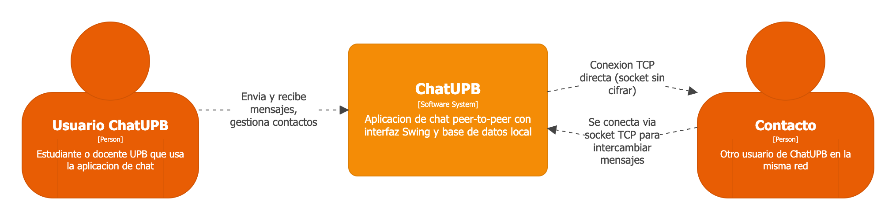
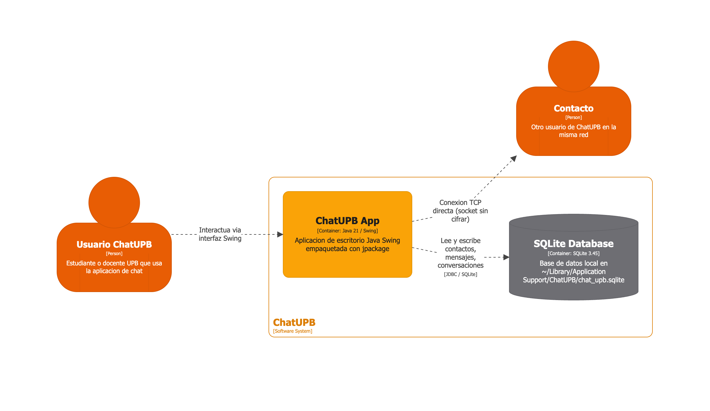
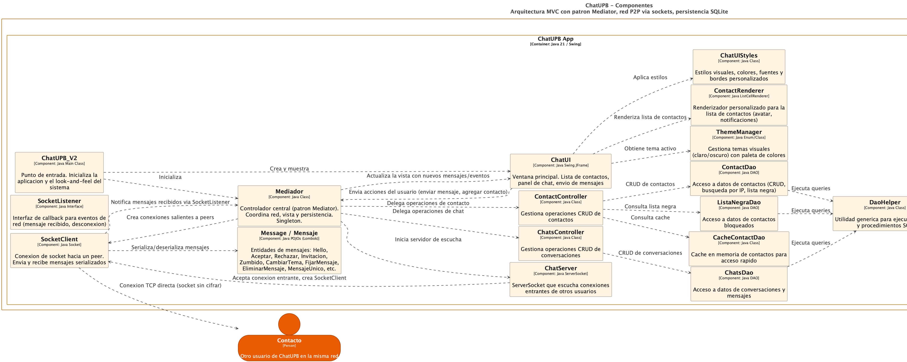
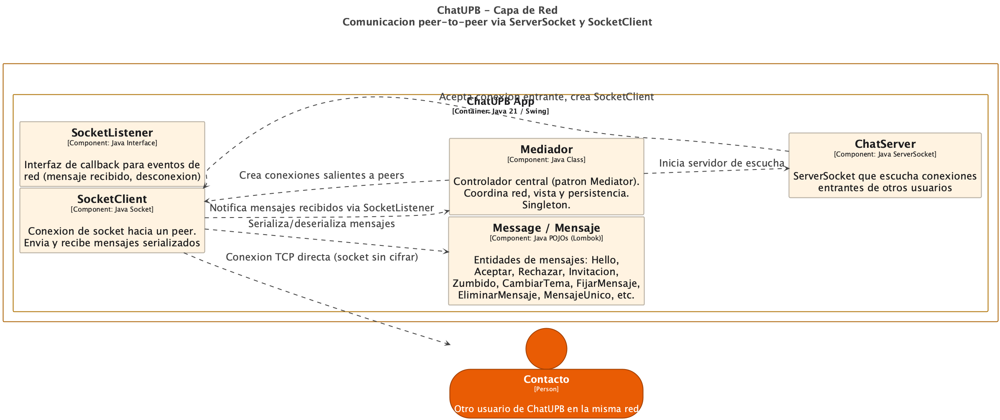
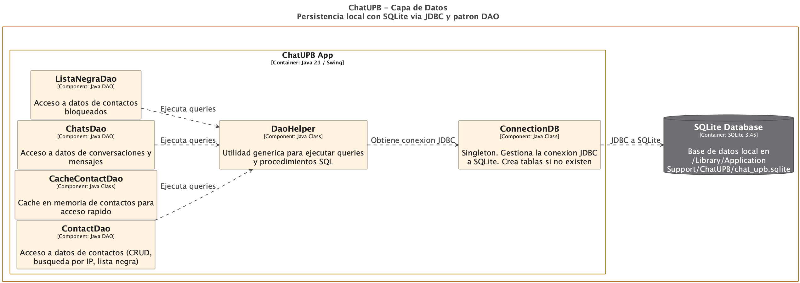

# ChatUPB

**Mensajeria peer-to-peer para la universidad. Sin servidores. Sin cuentas. Sin intermediarios.**


ChatUPB es una aplicacion de chat diseñada para estudiantes de la Universidad Privada Boliviana (UPB). Permite enviar mensajes directamente entre computadoras en la misma red, sin depender de servidores externos ni servicios de terceros.

## Por que ChatUPB?

- **Sin servidor central** - Los mensajes viajan directamente entre usuarios via TCP. No hay un servidor que almacene, lea o controle las conversaciones.
- **Sin cuenta ni registro** - Solo un nombre de usuario. No se necesita email, telefono ni contraseña de servicio.
- **Privacidad por diseño** - Los datos se quedan en tu computadora. SQLite local almacena el historial de chat, nada sale a la nube.
- **Instalacion en un clic** - Paquete `.pkg` nativo para macOS con Java 21 incluido. No hay dependencias externas que instalar.
- **Interfaz moderna** - Tema oscuro/claro, diseño limpio con lista de contactos, area de mensajes y mascota robot.
- **Codigo abierto** - Proyecto universitario con arquitectura documentada. Ideal para aprender patrones de diseño (MVC, Mediator, DAO).

## Como funciona

1. Abre ChatUPB e ingresa tu nombre
2. Agrega un contacto con su direccion IP (deben estar en la misma red)
3. Empieza a chatear - los mensajes se envian directamente, sin intermediarios

## Guias

| Guia | Descripcion |
|------|-------------|
| [Instalacion](docs/installation/installation.md) | Instalacion paso a paso en macOS (8 capturas) |
| [Uso de la Aplicacion](docs/app-usage/usage.md) | Inicio, contactos y chat P2P (3 capturas) |
| [Herramientas de Arquitectura](docs/tooling/tooling.md) | Structurizr, exportacion y publicacion (5 capturas) |

## Arquitectura

ChatUPB esta documentada con el [modelo C4](docs/01_c4_model.md) - 5 vistas que muestran la arquitectura desde el contexto general hasta los componentes internos.

- [Que es el Modelo C4?](docs/01_c4_model.md) - Historia, 4 niveles, principios
- [ChatUPB - Arquitectura](docs/02_chatupb_arquitectura.md) - Stack tecnico, patrones de diseño, vistas disponibles

### [C1] Contexto del Sistema


### [C2] Contenedores


<details>
<summary>Ver mas diagramas (C3, C3a, C3b)</summary>

### [C3] Componentes


### [C3a] Capa de Red


### [C3b] Capa de Datos


</details>

## Stack Tecnico

| Tecnologia | Uso |
|------------|-----|
| Java 21 | Lenguaje principal |
| Swing + MigLayout | Interfaz grafica |
| SQLite 3.45 | Base de datos local |
| TCP Sockets | Comunicacion peer-to-peer |
| Maven | Build y dependencias |
| jpackage | Instalador nativo macOS |

## Como visualizar la arquitectura

### Opcion 1: Structurizr local (interactivo)

```bash
brew install structurizr
git clone https://github.com/MSc-AGI/chatupb-c4.rp.git
structurizr local chatupb-c4.rp
```

Abrir http://localhost:8080/workspace/1

### Opcion 2: Structurizr online

Ir a [structurizr.com/dsl](https://structurizr.com/dsl) y pegar el contenido de `workspace.dsl`.

### Opcion 3: PlantUML

```bash
brew install plantuml
plantuml -tpng puml/*.puml
```

## Autora

Aplicacion desarrollada por Irene Landivar (irenelandivarc1@upb.edu) - Universidad Privada Boliviana.
