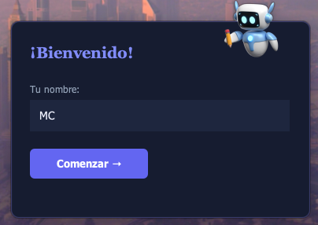
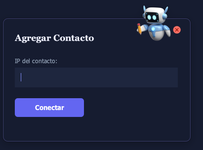
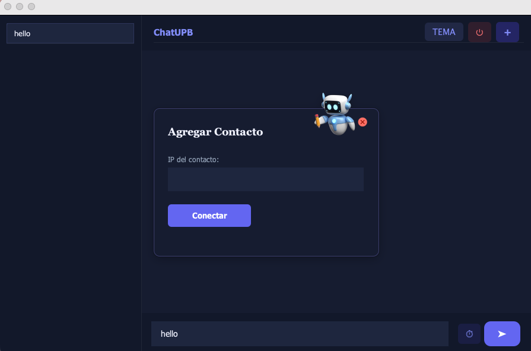

# Uso de la Aplicacion - ChatUPB

Guia de uso de ChatUPB despues de la instalacion.

## Paso 1: Bienvenida e Inicio

Al abrir ChatUPB, la pantalla de bienvenida solicita un nombre de usuario. Este nombre identifica al usuario en las conversaciones.

## Paso 2: Agregar un Contacto

Para iniciar una conversacion, se agrega un contacto ingresando su direccion IP. ChatUPB usa conexiones TCP peer-to-peer directas - no hay servidor central.

## Paso 3: Interfaz de Chat

La pantalla principal muestra:
- **Panel izquierdo**: lista de contactos conectados
- **Panel central**: area de conversacion
- **Barra inferior**: campo de texto para mensajes con boton de enviar
- **Barra superior**: nombre de la aplicacion, boton de tema (TEMA), boton de cerrar sesion y boton (+) para agregar contactos

---

Anterior: [Guia de Instalacion](../installation/installation.md) | Siguiente: [Herramientas de Arquitectura](../tooling/tooling.md)
