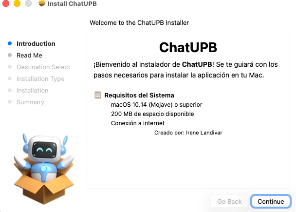
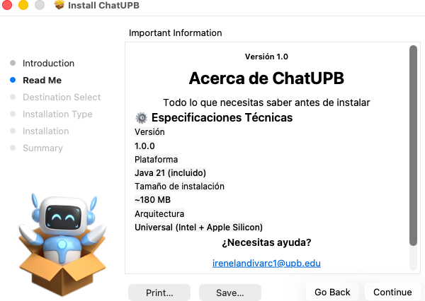
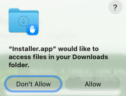
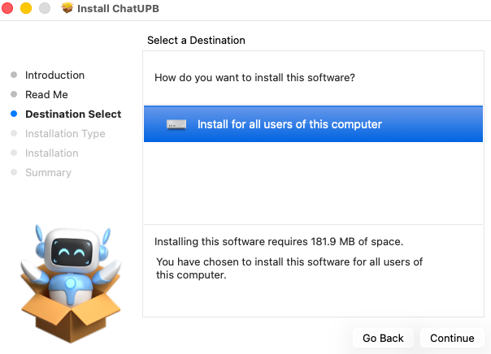
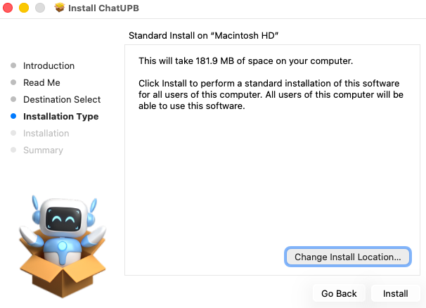
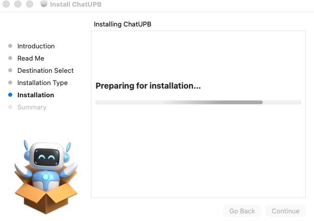
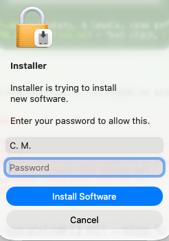
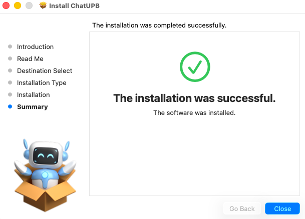

# Guia de Instalacion - ChatUPB

Instalacion paso a paso de ChatUPB en macOS usando el paquete `ChatUPB-1.0.pkg`.

## Requisitos del Sistema

- macOS 10.14 (Mojave) o superior
- 200 MB de espacio disponible
- Conexion a internet (para chat P2P)
- Arquitectura: Universal (Intel + Apple Silicon)

## Paso 1: Bienvenida

Al abrir el archivo `.pkg`, el instalador muestra la pantalla de bienvenida con los requisitos del sistema y la version de la aplicacion.

## Paso 2: Informacion Tecnica

El instalador muestra las especificaciones tecnicas: version 1.0.0, Java 21 incluido, tamano de instalacion ~180 MB. Incluye el contacto de la autora (irenelandivarc1@upb.edu).

## Paso 3: Permiso de Acceso

macOS solicita permiso para que el instalador acceda a la carpeta de Descargas.

## Paso 4: Seleccion de Destino

Se selecciona donde instalar la aplicacion. La opcion predeterminada es instalar para todos los usuarios del equipo. Requiere 181.9 MB de espacio.

## Paso 5: Tipo de Instalacion

Confirmacion del tipo de instalacion estandar en el disco principal (Macintosh HD). Es posible cambiar la ubicacion si se desea.

## Paso 6: Progreso

La instalacion comienza. La barra de progreso muestra el avance.

## Paso 7: Contrasena del Sistema

macOS solicita la contrasena de administrador para autorizar la instalacion del software.

## Paso 8: Instalacion Exitosa

La instalacion se completa. ChatUPB esta listo para usar desde la carpeta Aplicaciones.

---

Siguiente: [Uso de la Aplicacion](../app-usage/usage.md)
