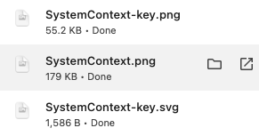
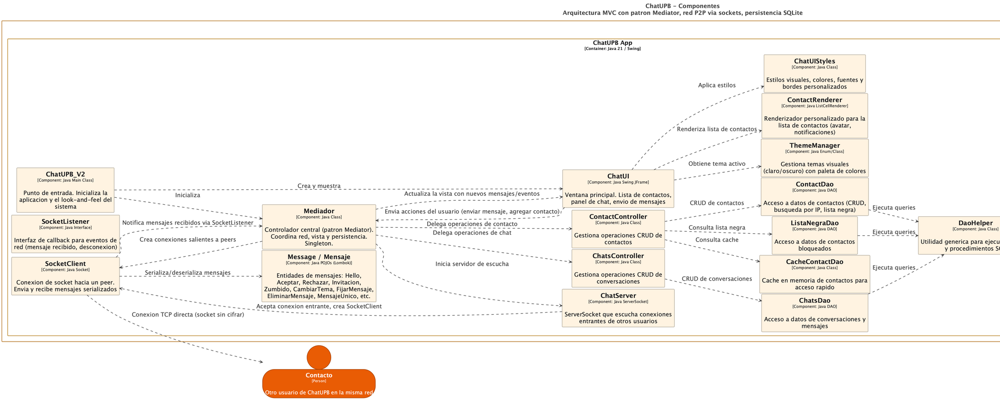
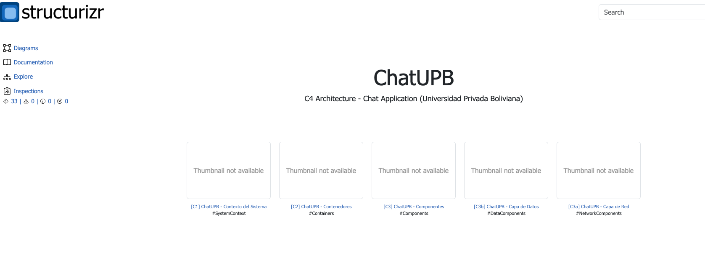
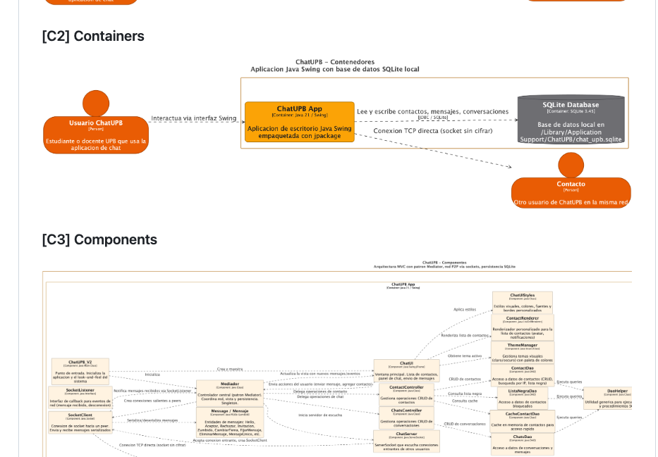

# Herramientas de Arquitectura - ChatUPB

Documentacion del proceso de creacion de los diagramas C4 usando [Structurizr](https://structurizr.com/).

## Structurizr: Servidor Local

Structurizr es una herramienta para visualizar arquitectura de software usando el modelo C4. Se ejecuta localmente para desarrollo:

```bash
brew install structurizr
structurizr local <ruta-al-workspace>
```

## Exportar Diagramas

Structurizr permite exportar diagramas en formato SVG y PNG. El dialogo de exportacion muestra todas las vistas disponibles con opciones de recorte y metadatos.


### Archivos Exportados

Los archivos exportados se descargan al sistema local. Cada vista genera un archivo PNG y SVG.



## Resultado: Diagramas C4

### Vista C3 - Componentes (SVG)

El diagrama de componentes muestra los 17 componentes internos de ChatUPB con sus relaciones: arquitectura MVC, patron Mediator, capa de red TCP y persistencia SQLite.



### Workspace ChatUPB en Structurizr

La pagina principal del workspace de ChatUPB en Structurizr muestra las 5 vistas disponibles: C1 Contexto, C2 Contenedores, C3 Componentes, C3a Capa de Red, C3b Capa de Datos.



## Publicacion en GitHub

Los diagramas exportados se integran directamente en el README del repositorio de GitHub, haciendolos visibles sin necesidad de ejecutar Structurizr.



---

Anterior: [Uso de la Aplicacion](../app-usage/usage.md)
